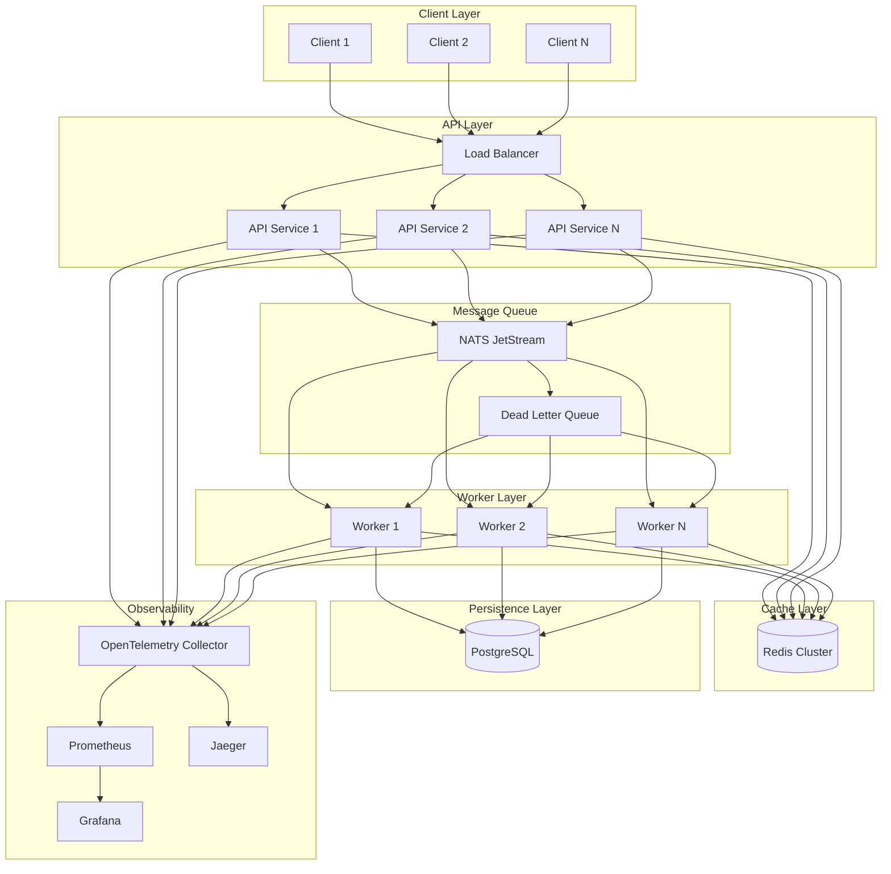
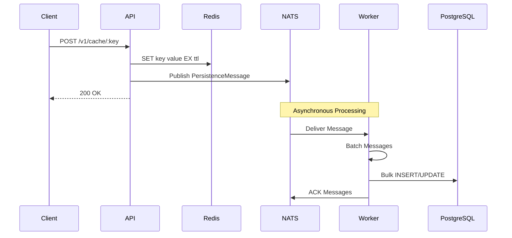
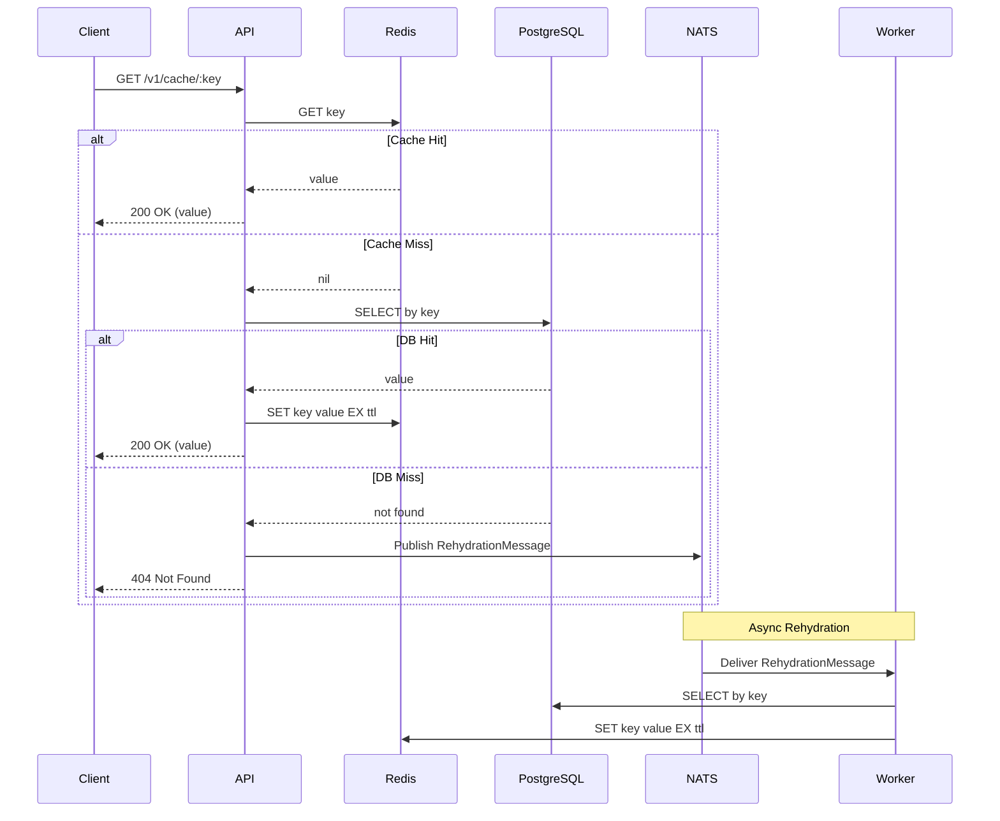
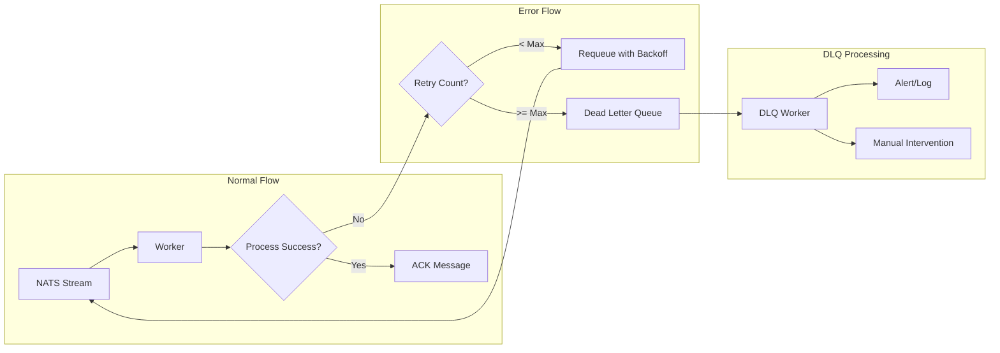

# 🏗️ Birb Nest Architecture

## Table of Contents
- [Overview](#overview)
- [System Components](#system-components)
- [Data Flow Patterns](#data-flow-patterns)
- [Design Principles](#design-principles)
- [Technology Choices](#technology-choices)
- [Scaling Strategy](#scaling-strategy)
- [Performance Optimizations](#performance-optimizations)
- [Security Considerations](#security-considerations)

## Overview

Birb Nest is a high-performance distributed caching service that combines the speed of Redis with the durability of PostgreSQL. The system implements a double-write pattern with asynchronous persistence, ensuring both high availability and data consistency.

### High-Level Architecture



## System Components

### 1. API Service (`cmd/api`)

The API service is the entry point for all client interactions. Built with the Fiber framework for high performance, it handles:

- **REST API endpoints** for cache operations (GET, POST, DELETE)
- **Double-write coordination** to Redis and NATS
- **Read-through cache** with automatic fallback
- **Health checks** and metrics exposure
- **Request validation** and error handling

Key features:
- Stateless design for horizontal scaling
- Circuit breakers for downstream services
- Request rate limiting and throttling
- Structured logging with correlation IDs

### 2. Redis Cache Layer

Redis serves as the primary cache layer, providing:

- **Sub-millisecond latency** for cache hits
- **TTL-based expiration** for automatic cleanup
- **Cluster mode** for high availability
- **Pipelining** for batch operations

Configuration considerations:
- Memory policy: `allkeys-lru` for automatic eviction
- Persistence: AOF with `everysec` for durability
- Replication: Master-slave with sentinel for HA

### 3. NATS JetStream Queue

NATS JetStream provides reliable message delivery with:

- **Persistent streams** for durability
- **Consumer groups** for work distribution
- **At-least-once delivery** guarantees
- **Message deduplication** by key
- **Custom DLQ implementation** for failure handling

Stream configuration:
```yaml
Stream: CACHE_PERSISTENCE
Subjects: cache.persist.>, cache.rehydrate.>
Retention: Limits (1M messages or 1GB)
Acknowledgment: Explicit
Max Redeliveries: 3
```

### 4. Worker Service (`cmd/worker`)

Workers process messages asynchronously with:

- **Batch processing** for efficiency (configurable batch size)
- **Graceful shutdown** with drain support
- **Concurrent processing** with configurable workers
- **Version checking** to prevent stale updates
- **Rehydration logic** for cache warming

Processing patterns:
- Persistence: Queue → Batch → PostgreSQL
- Rehydration: Queue → PostgreSQL → Redis
- DLQ retry: Exponential backoff with jitter

### 5. PostgreSQL Database

PostgreSQL provides durable storage with:

- **JSONB columns** for flexible value storage
- **Optimistic locking** via version fields
- **Connection pooling** with pgx
- **Prepared statements** for performance
- **Partitioning** for scale (future enhancement)

Schema design:
```sql
CREATE TABLE cache_entries (
    key VARCHAR(255) PRIMARY KEY,
    value JSONB NOT NULL,
    version INTEGER NOT NULL DEFAULT 1,
    created_at TIMESTAMP WITH TIME ZONE DEFAULT NOW(),
    updated_at TIMESTAMP WITH TIME ZONE DEFAULT NOW()
);

CREATE INDEX idx_cache_entries_updated_at ON cache_entries(updated_at);
```

## Data Flow Patterns

### Write Path (Double-Write Pattern)



### Read Path (Cache-Aside Pattern)



### DLQ Processing Pattern



## Design Principles

### 1. **High Availability**
- No single point of failure
- Graceful degradation when components fail
- Automatic failover for critical services

### 2. **Performance First**
- Cache-first architecture
- Batch processing for efficiency
- Connection pooling and reuse
- Minimal network round trips

### 3. **Data Consistency**
- Version tracking prevents stale updates
- At-least-once message delivery
- Idempotent operations where possible

### 4. **Observability**
- Distributed tracing for request flow
- Metrics for all operations
- Structured logging with correlation
- Health checks at every layer

### 5. **Developer Experience**
- Simple REST API
- Comprehensive error messages
- Self-documenting endpoints
- Easy local development setup

## Technology Choices

### Language: Go
- **Performance**: Compiled language with excellent concurrency
- **Simplicity**: Easy to read and maintain
- **Ecosystem**: Rich library support for our use cases
- **Deployment**: Single binary deployment

### Web Framework: Fiber
- **Performance**: Built on fasthttp, ~10x faster than net/http
- **Express-like API**: Familiar to many developers
- **Middleware**: Rich middleware ecosystem
- **WebSocket support**: For future real-time features

### Cache: Redis
- **Performance**: Sub-millisecond latency
- **Features**: TTL, data structures, Lua scripting
- **Ecosystem**: Mature with excellent Go client (go-redis)
- **Operations**: Well-understood operational characteristics

### Queue: NATS JetStream
- **Performance**: Millions of messages per second
- **Features**: Persistence, exactly-once semantics, wildcards
- **Simplicity**: Single binary, easy operations
- **Cloud-native**: Built for modern infrastructure

### Database: PostgreSQL
- **JSONB**: Flexible schema with indexing
- **ACID**: Strong consistency guarantees
- **Performance**: Excellent with proper tuning
- **Operations**: Mature tooling and practices

### Observability: OpenTelemetry
- **Vendor-neutral**: Avoid lock-in
- **Comprehensive**: Traces, metrics, and logs
- **Standard**: Industry-standard for observability
- **Ecosystem**: Wide integration support

## Scaling Strategy

### Horizontal Scaling

#### API Service
- Stateless design enables linear scaling
- Load balancer distributes requests
- Health checks ensure only healthy instances receive traffic
- Auto-scaling based on CPU/memory metrics

#### Worker Service
- Scale based on queue depth
- Each worker processes messages independently
- Batch size adjusts based on load
- Consumer groups ensure work distribution

### Vertical Scaling

#### Redis
- Memory-bound workload
- Scale up for larger working sets
- Use Redis Cluster for beyond single-node capacity

#### PostgreSQL
- Start with vertical scaling
- Read replicas for read-heavy workloads
- Partitioning for time-series data
- Connection pooling to maximize throughput

### Capacity Planning

```
Assumptions:
- Average key size: 50 bytes
- Average value size: 1 KB
- Cache hit rate: 90%
- TTL: 1 hour

10,000 req/s capacity requires:
- Redis: ~4GB RAM (1M active keys)
- PostgreSQL: ~100GB storage (100M keys/month)
- API instances: 4-8 (depending on instance type)
- Worker instances: 2-4 (batch processing)
```

## Performance Optimizations

### 1. **Batch Processing**
- Workers batch messages before database writes
- Reduces database round trips by 10-100x
- Configurable batch size and timeout

### 2. **Connection Pooling**
- Database: Max 100 connections, 25 idle
- Redis: Max 1000 connections, 100 idle
- NATS: Persistent connection with reconnect

### 3. **Prepared Statements**
- Database queries use prepared statements
- Reduces parsing overhead
- Improves security (SQL injection prevention)

### 4. **Circuit Breakers**
- Fail fast when services are down
- Prevent cascade failures
- Automatic recovery when service returns

### 5. **Caching Headers**
- ETag support for conditional requests
- Cache-Control for client-side caching
- Reduces unnecessary data transfer

## Security Considerations

### 1. **Input Validation**
- Key format validation (alphanumeric + limited special chars)
- Value size limits (default 1MB)
- Request rate limiting per client

### 2. **Authentication & Authorization**
- API key authentication (future)
- Role-based access control (future)
- Audit logging for all operations

### 3. **Data Protection**
- TLS for all network communication
- Encryption at rest for sensitive data
- Key rotation support

### 4. **Operational Security**
- Principle of least privilege
- Network segmentation
- Regular security updates
- Vulnerability scanning

## Future Enhancements

### Near Term
1. **Multi-region replication** for global distribution
2. **GraphQL API** for flexible queries
3. **Compression** for large values
4. **Batch API operations** for bulk updates

### Long Term
1. **Change Data Capture (CDC)** for real-time sync
2. **Time-series support** with automatic rollups
3. **ML-based cache warming** predictions
4. **Edge deployment** for ultra-low latency

## Conclusion

Birb Nest's architecture balances performance, reliability, and operational simplicity. The double-write pattern ensures durability without sacrificing speed, while the modular design allows for independent scaling and evolution of components.

The use of proven technologies (Redis, PostgreSQL, NATS) reduces operational risk, while modern practices (OpenTelemetry, containerization) ensure the system is ready for cloud-native deployments.

🐦 Built with love by the Birb Party team!
